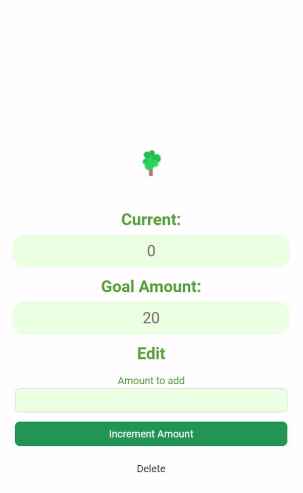
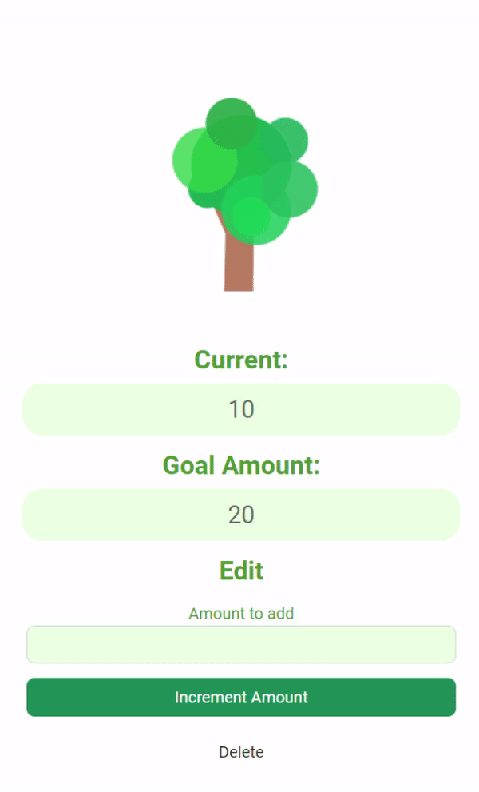

# SaveTree
## SaveTree helps kids understand the value of saving money
### Team Mentor: Jamie Sanson
### Created by Isaac, Kristine, Ming, Sacha, Amy, and Elijah in just over two days!

### Gamification
An intuitive, fun, and rewarding way to see where your money is going. 
Set goals, allocate your resources, and watch your trees grow into a forest!

  
  
  
 

